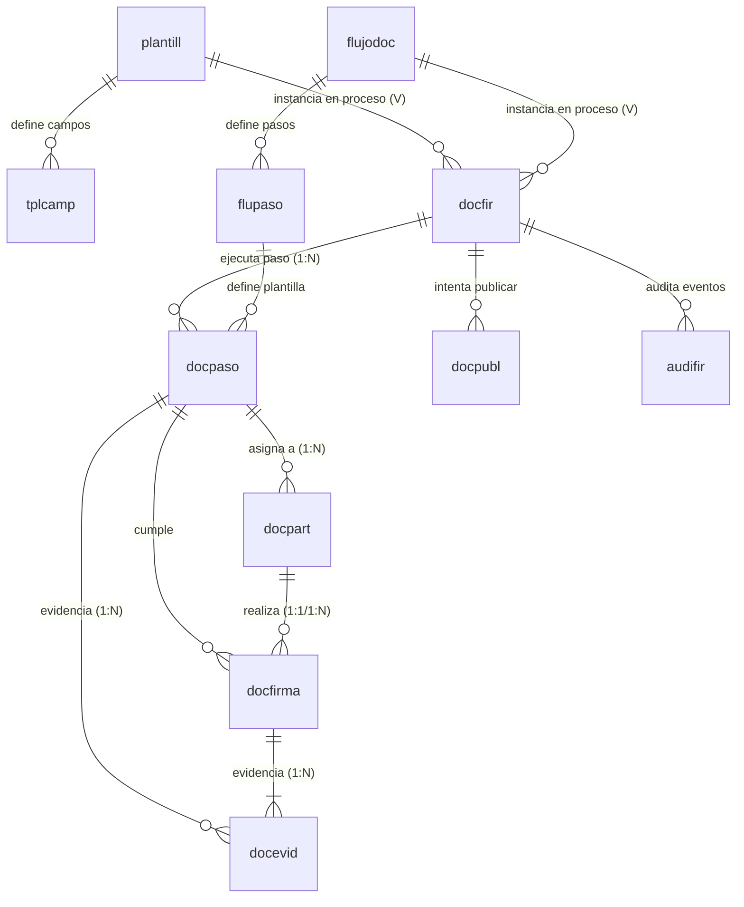

# Modelo de Datos V1 - FirmaDoc

## 1. Propósito
Este documento especifica oficialmente el modelo físico de datos de FirmaDoc V1, alineado con la arquitectura documental de firma. Este modelo soporta la gestión de procesos documentales, flujos secuenciales, pasos, participantes, firmantes, firmas, evidencias, publicación idempotente en Alfresco, auditoría y plantillas congeladas por versión. 

**Definición de responsabilidades:**
- **Alfresco** almacena los documentos fuente y finales.
- **PostgreSQL** almacena metadatos, estados, configuración y evidencia inmutable.
- **PostgreSQL NO almacena** PDFs ni imágenes crudas de firma en formato binario.

## 2. Principios de diseño
1. **Integridad referencial:** Toda entidad debe estar fuertemente vinculada mediante Foreign Keys (FK).
2. **Auditoría completa:** Cada acción debe dejar trazabilidad operativa y evidencia técnica estructurada.
3. **No borrado físico de información auditada:** Se prohíbe eliminar registros; se utilizarán flags de activo o estados de inactividad lógicos.
4. **Estados validados:** Los estados deben validarse tanto en la lógica de aplicación (Pydantic) como en PostgreSQL (CHECK constraints).
5. **Idempotencia:** Las operaciones críticas (ej. publicación) deben usar claves únicas para prevenir duplicidad.
6. **Concurrencia controlada:** Emplear controles de unicidad, revisiones de estado y locks lógicos donde proceda.
7. **Timestamps con zona horaria:** Todas las fechas y horas deben registrarse con timezone (TIMESTAMPTZ).
8. **Firmas vinculadas:** Toda firma debe corresponder estrictamente a un `nodeId`, versión y hash.
9. **Plantilla y flujo congelados:** Un proceso instanciado debe conservar la versión de la plantilla y del flujo, independientemente de futuros cambios en sus definiciones base.
10. **Separación de roles:** Participante, firmante, paso y firma son entidades lógicas y físicamente distintas.
11. **No almacenar binarios:** Está prohibido usar tipos bytea/blob para PDFs o imágenes de firma.
12. **Compatibilidad con migraciones:** Todos los cambios y constraints deben ser aplicables mediante Alembic sin corromper datos existentes.

## 3. Diagrama ER

**Justificación de cardinalidades:**
- `flujodoc 1:N flupaso`: Un flujo define varios pasos secuenciales abstractos.
- `docfir 1:N docpaso`: Un proceso crea instancias concretas de ejecución de los pasos.
- `flupaso 1:N docpaso`: Un paso abstracto puede ser instanciado en múltiples procesos.
- `docpaso 1:N docpart`: Un paso en ejecución puede asignarse a cero, uno o múltiples participantes.
- `docpaso 1:N docfirma`: Un paso en ejecución recopila firmas.
- `docpart 1:N docfirma`: Un participante asignado realiza firmas (generalmente 1:1, pero permite N en casos multifirma).
- `docpaso 1:N docevid` y `docfirma 1:N docevid`: Acciones o firmas generan múltiples eventos inmutables (ej. completado, rechazado, captura de firma, incorporación).

## 4. Separación de Responsabilidades (Flujo, Paso, Participante)
- **flupaso (Definición):** Define el paso reusable del flujo (tipo, obligatoriedad, roles requeridos). **No guarda** ejecución, fechas reales, participantes, ni resultados.
- **docpaso (Ejecución):** Guarda la ejecución real del paso dentro de `docfir`. **Responsable de** estado del paso (PENDIENTE, DISPONIBLE, EN_PROCESO), fechas reales, vencimientos, resultados, rechazos, reactivación, y concurrencia (`verlock`).
- **docpart (Asignación):** Guarda las personas/entidades asignadas a un `docpaso`. **No representa** el estado global del paso (puede haber pasos sin participantes humanos, como PUBLICAR).

## 5. Entidades de Flujo y Proceso

### 5.1 Tabla docfir
- **Columnas:** `docid` (PK), `nodid`, `docnom`, `mimtip`, `tamano`, `estado` (BORRADOR, PREPARADO, EN_CURSO, PENDIENTE_FIRMA, FIRMADO_PARCIAL, PENDIENTE_PUBLICACION, COMPLETADO, RECHAZADO, CANCELADO, ERROR_PUBLICACION), `tplid` (FK a plantill), `fluid` (FK a flujodoc), `verini`, `verfin`, `hasori`, `hasfir`, `activo`, `usrcre`, `feccre`, `usrmod`, `fecmod`.
- **Reglas:** `fluid` y `tplid` obligatorios desde PREPARADO.

### 5.2 Tabla flujodoc
- **Columnas:** `fluid` (PK), `flucod`, `flunom`, `fluver`, `estado` (BORRADOR, ACTIVO, INACTIVO), `activo`, `usrcre`, `feccre`, `usrmod`, `fecmod`.
- **Reglas:** Código + versión único. Solo una versión activa por código.

### 5.3 Tabla flupaso
- **Columnas:** `pasid` (PK), `fluid` (FK), `pascod`, `pasnom`, `pastip` (DILIGENCIAR, REVISAR, APROBAR, FIRMAR, ATESTIGUAR, CERRAR, PUBLICAR), `orden`, `rolreq`, `obliga` (Boolean), `plazo` (Minutos), `config` (JSONB), `activo`, `usrcre`, `feccre`, `usrmod`, `fecmod`.

## 6. Entidades de Ejecución

### 6.1 Tabla docpaso
Representa la ejecución concreta de un paso definido en `flupaso` dentro de un proceso `docfir`.
- **Columnas:** `dpasid` (PK), `docid` (FK), `pasid` (FK), `orden` (Integer), `estado` (PENDIENTE, DISPONIBLE, EN_PROCESO, COMPLETADO, RECHAZADO, OMITIDO, CANCELADO, VENCIDO), `fecdis`, `fecini`, `feclim`, `fecfin` (Timestamptz nullable), `result` (Varchar/JSONB nullable), `motivo` (Varchar/Text sanitizado nullable), `verlock` (Integer obligatorio), `activo`, `usrcre`, `feccre`, `usrmod`, `fecmod`.
- **Reglas:**
  - Una instancia única por `docid` + `pasid`.
  - Orden único por `docid`, orden > 0.
  - `fecini` obligatoria cuando estado >= EN_PROCESO.
  - `fecfin` obligatoria cuando estado es COMPLETADO, RECHAZADO, OMITIDO o CANCELADO.
  - `motivo` obligatorio para RECHAZADO, OMITIDO, CANCELADO cuando aplique.
  - `verlock` se incrementa en cada transición (Control optimista).
  - ON DELETE RESTRICT estricto.
- **Congelación de Flujo:** `docpaso` referencia a `flupaso` (que está inmutablemente versionado). Atributos críticos (orden) se copian a `docpaso` para asegurar reproducibilidad rápida.

### 6.2 Tabla docpart
Participantes asignados a la ejecución de un paso.
- **Columnas:** `parid` (PK), `dpasid` (FK principal a docpaso), `usrid` (Varchar 60, identificador estable), `nomcom` (Varchar 150, nombre congelado), `correo` (Varchar 100, correo congelado), `rolpro` (Varchar 100, rol congelado nullable), `orden` (Integer, para secuencias, inicia en 1), `obliga` (Boolean), `estado` (PENDIENTE, DISPONIBLE, EN_PROCESO, COMPLETADO, RECHAZADO, OMITIDO, CANCELADO, VENCIDO), `motivo` (Varchar 500, nullable), `result` (JSONB, nullable), `fecdis` (Timestamptz nullable), `fecini` (Timestamptz nullable), `fecfin` (Timestamptz nullable), `verlock` (Integer optimista, default 1), `usrcre`, `feccre`, `usrmod`, `fecmod`.
- **Reglas:**
  - Identidad se resuelve desde un componente central en base a `usrid`. El frontend no es confiable para inyectar `nomcom`, `correo` ni `rolpro`.
  - Un participante puede existir sin firmar (Ej. Revisor).
  - Un `docpaso` con intervención humana debe tener al menos un `docpart` obligatorio (`obliga=true`).
  - Única asignación por `dpasid` + `usrid`. Único orden por `dpasid` + `orden`.
  - Estados terminales exigen `motivo` cuando corresponde (RECHAZADO, OMITIDO, CANCELADO).
  - ON DELETE RESTRICT estricto. La navegación al documento padre siempre es a través de `docpaso.docid` para asegurar consistencia.

## 7. Tabla docfirma
Registro y evidencia lógica de la firma.
- **Columnas:** `firid` (PK), `docid` (FK), `dpasid` (FK), `parid` (FK opcional cuando es humano), `camid` (FK a tplcamp), `nodid` (Obligatorio), `verdoc` (Obligatorio), `hashdoc` (Obligatorio Hex 64), `firtip` (MANUSCRITA_CAPTURADA, ELECTRONICA_AUTENTICADA), `estado` (PENDIENTE, CAPTURADA, CONFIRMADA, INCORPORADA, INVALIDADA), `hashim` (Hash de imagen capturada), `metcap` (JSONB), `fecapt`, `feccon`, `fecinc`, `activo`.
- **Reglas:**
  - `nodid`, `verdoc` y `hashdoc` son persistencia directa e inmutable de la versión que el usuario observó al firmar (no debe depender dinámicamente de `docfir`).
  - MANUSCRITA_CAPTURADA exige `hashim` cuando estado >= CAPTURADA y exige `fecapt`.
  - ELECTRONICA_AUTENTICADA permite `hashim` null.
  - INCORPORADA exige `fecinc`; CONFIRMADA exige `feccon`.
  - Una firma única por `dpasid` + `parid` + `camid`.
  - No almacenar binarios (ni imágenes, ni SVG). ON DELETE RESTRICT estricto.

## 8. Tabla docevid
Evidencia técnica inmutable sobre acciones críticas.
- **Columnas:** `evid` (PK), `docid` (FK), `dpasid` (FK opcional), `parid` (FK opcional), `firid` (FK opcional), `evicod`, `accion`, `nodid`, `version`, `hashdoc`, `usrid`, `iporig`, `usragn`, `dispot` (Timezone), `zonhor`, `declar` (Texto aceptado), `result`, `fecope`.
- **Reglas:**
  - No requiere `firid` si la evidencia es de paso (Ej. revisión completada, aprobación o rechazo).
  - Inmutabilidad estricta (Sin UPDATE/DELETE). 
  - Diferente a `audifir`, que es trazabilidad operativa general; `docevid` es evidencia técnica legal ligada a versión y hash.

## 9. Tabla docpubl
Manejo de publicación idempotente en Alfresco.
- **Columnas:** `pubid` (PK), `docid` (FK), `idemky` (Hash Determinista), `estado` (PENDIENTE, EN_PROCESO, VERIFICANDO, PUBLICADA, ERROR, REINTENTO, REVISION_MANUAL), `verori`, `verdes`, `hashfin`, `intento`, `ultint`, `error`, `alfver`, `alfnod`, `feccre`, `fecmod`.
- **Reglas:** Una sola `idemky` por publicación. Solo guarda el último intento y contador (historial detallado va a `audifir`). Error sanitizado.

## 10. Constraints Cruzados
*(La DB aplicará FK y UNIQUE, validaciones cruzadas complejas irán en el servicio)*
- `FK`: `docpaso.pasid` -> `flupaso.pasid`.
- `UNIQUE`: `docpart` no puede repetir `(dpasid, usrid, rolpro)`.
- `UNIQUE`: `docfirma` no puede repetir `(dpasid, parid, camid)`.
- `Validación Servicio`: `docpaso.pasid` debe pertenecer al `fluid` congelado en `docfir`.
- `Validación Servicio`: `camid` en la firma debe pertenecer a la plantilla congelada en `docfir`.
- `Validación Servicio`: `docfirma.hashdoc` y `docevid.hashdoc` deben corresponder al proceso y versión vigente.

## 11. Índices (Enfoque Parcial y Alta Cardinalidad)
Se priorizarán índices parciales para evitar overhead inútil:
- **docpaso:**
  - `CREATE INDEX idx_docpaso_disp ON docpaso (docid) WHERE estado IN ('DISPONIBLE', 'EN_PROCESO');`
  - `CREATE INDEX idx_docpaso_vencido ON docpaso (feclim) WHERE estado NOT IN ('COMPLETADO', 'RECHAZADO', 'CANCELADO', 'OMITIDO');`
- **docfir:**
  - `CREATE INDEX idx_docfir_bandeja ON docfir (nodid, fluid) WHERE estado IN ('EN_CURSO', 'PENDIENTE_FIRMA');`
- **docpubl:**
  - `CREATE INDEX idx_docpubl_pendientes ON docpubl (idemky) WHERE estado IN ('PENDIENTE', 'REINTENTO', 'VERIFICANDO', 'REVISION_MANUAL');`
*(Se evitarán índices globales de baja cardinalidad como sobre un campo simple `activo` o `estado` aislado).*

## 12. Concurrencia (DB y API)
- `verlock` en `docpaso`: Para control optimista. Cualquier UPDATE a un paso hará `WHERE dpasid = X AND verlock = Y` incrementando el `verlock`. Si falla, levanta un `409 Conflict`.
- Unicidad en BD para impedir ejecución duplicada de pasos y firmas.
- Bloqueos transaccionales `SELECT FOR UPDATE` si son necesarios en la publicación.

## 13. Idempotencia Determinista
No deben usar timestamps. Permiten recuperación y reintento seguro.
- **Iniciar proceso:** `SHA-256(nodid + verini + hasori + usrcre + "INICIAR_PROCESO")`. Ámbito: Persistido en log temporal o validado vía Constraint para evitar dobles procesos sobre la misma versión exacta en el mismo segundo.
- **Completar paso:** Clave enviada por el cliente o generada determinísticamente, persistida temporalmente (Cache/Redis) para evitar que la app explote si el request se pierde tras completar la transacción `verlock`.
- **Confirmar firma:** `SHA-256(docid + dpasid + parid + firid + hashdoc + "CONFIRMAR_FIRMA")`.
- **Publicar en Alfresco:** `SHA-256(docid + nodid + verini + hasfir + "PUBLICACION_ALFRESCO")`. Persistido inmutable en `docpubl.idemky`.

## 14. ON DELETE Políticas
- `docpart` → `docpaso`: **RESTRICT**
- `docpart` → `docfir`: **RESTRICT**
- `docfirma` → `docpaso`: **RESTRICT**
- `docfirma` → `docpart`: **RESTRICT**
- `docevid` → Todas sus relaciones: **RESTRICT** (Inmutabilidad absoluta).
- `docpubl` → `docfir`: **RESTRICT**

## 15. Estrategia de Migración (Alembic)
1. Crear `flujodoc`, `flupaso`.
2. Crear `docpaso`.
3. Crear `docpart`, `docfirma`, `docevid`, `docpubl`.
4. Añadir `fluid`, `tplid` a `docfir`.
5. Crear flujos por defecto para procesos existentes y asignar `fluid`.
6. Crear instancias `docpaso` para los procesos vigentes (asignando estado).
7. Mapear los estados de `docfir` (ej. PENDIENTE -> EN_CURSO, ERROR -> ERROR_PUBLICACION).
8. Aplicar FKs y `NOT NULL` a las tablas nuevas (Backfill exitoso).
9. Aplicar Constraints (Uniques, Checks) e índices parciales.
10. Validar datos resultantes.
11. Modificar y ampliar `CHECK` de `docfir.estado` borrando el viejo.
*Nota: Procesos huérfanos muy antiguos o inconsistentes deben forzarse a `CANCELADO` antes de inyectar las restricciones estrictas.*

## 16. Decisiones de Diseño Formativas
- **DD-001:** Alfresco repositorio maestro.
- **DD-002:** No guardar PDFs en PostgreSQL.
- **DD-003:** No guardar imagen cruda manuscrita (ni temporal permanente).
- **DD-004:** Plantilla congelada (inmutabilidad).
- **DD-005:** Flujo congelado (inmutabilidad).
- **DD-006:** Firma atada a nodid + versión + hash inmutablemente.
- **DD-007:** Publicación idempotente `GET-before-POST` gestionada por `docpubl`.
- **DD-008:** Evidencia imborrable (`ON DELETE RESTRICT` y flags de `activo`).
- **DD-009:** Flujos V1 Secuenciales puros.
- **DD-010:** COMPLETADO = Confirmado en Alfresco.
- **DD-011:** Separación Definición, Ejecución y Asignación. *Flupaso define, docpaso ejecuta, docpart asigna.* Permite pasos automáticos, participantes múltiples y control de concurrencia optimista (`verlock`).

## 17. Reglas de Consentimientos y Participantes (Aclaratorias)
- En un consentimiento, las "casillas de selección" de autorizaciones médicas son conceptualmente independientes de la decisión de firmar el documento (no seleccionar una casilla no implica el rechazo de todo el proceso documental).
- Representantes legales, menores de edad, testigos y demás son modelados como `Participante` (`docpart`) con roles genéricos parametrizables (`rolpro`), difiriendo el control semántico estricto a la capa de servicios sin requerir entidades específicas para cada variante biológica/legal.

## 18. Criterios de Aceptación
Documento final revisado contra la arquitectura. Sin riesgos ORM, relaciones 100% definidas y entidades independientes. Listo para iniciar modelado en SQLAlchemy.
